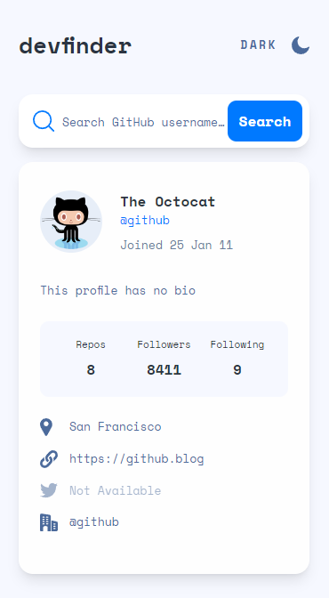

# Frontend Mentor - GitHub user search app solution

Hello again, everyone! 👋 This will be my 9th submission! 🎉

This is a solution to the [GitHub user search app challenge on Frontend Mentor](https://www.frontendmentor.io/challenges/github-user-search-app-Q09YOgaH6). Frontend Mentor challenges help you improve your coding skills by building realistic projects.

## Table of contents

- [Overview](#overview)
  - [The challenge](#the-challenge)
  - [Screenshot](#screenshot)
  - [Links](#links)
- [My process](#my-process)
  - [Built with](#built-with)
  - [What I learned](#what-i-learned)
  - [Continued development](#continued-development)
  - [Useful resources](#useful-resources)
- [Author](#author)

## Overview

### The challenge

Users should be able to:

- View the optimal layout for the app depending on their device's screen size ✅
- See hover states for all interactive elements on the page ✅
- Search for GitHub users by their username ✅
- See relevant user information based on their search ✅
- Switch between light and dark themes ✅
- **Bonus**: Have the correct color scheme chosen for them based on their computer preferences. _Hint_: Research `prefers-color-scheme` in CSS. ✅\*

### Screenshot

### Links

- Solution URL: [Add solution URL here](https://your-solution-url.com)
- Live Site URL: [Add live site URL here](https://your-live-site-url.com)

## My process

### Built with

- Semantic HTML5 markup
- Flexbox & CSS Grid
- Mobile-first workflow
- [React](https://reactjs.org/) - JS library
- [Tailwind CSS](https://tailwindcss.com/) - For styles
- [Tanstack/React Query](https://tanstack.com/query/latest) - Handling API Data

### What I learned

This challenge helped me get more comfortable using Tailwind, implementing dark mode, and dynamically rendering specific elements. I have done similar projects in the past and it felt good to come in and build the app with very little googling.

### Continued development

This app is feature complete, I don't foresee any future developments.

### Useful resources

- [Tailwind Docs](https://tailwindcss.com/docs) - The Tailwind documentation is some of the best, anything I needed to figure out super straightforward.

## Author

- Website - [Joshua Hellard](https://www.hellard.dev)
- Frontend Mentor - [@jhellard](https://www.frontendmentor.io/profile/jhellard)

\* The `prefers-color-scheme` methos is functioning, I currently have it set up in the Tailwind config to use the class method, if this is removed the mode should be set to the system. I need to look more in to the docs and implement both methods together soon.
